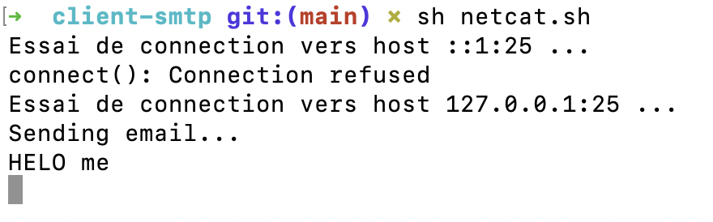
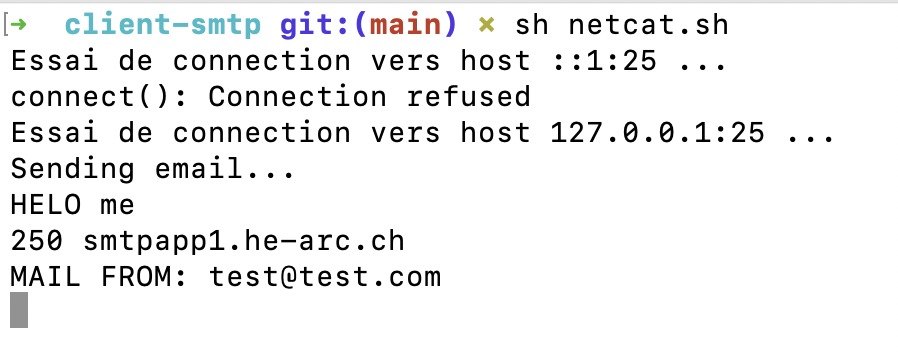
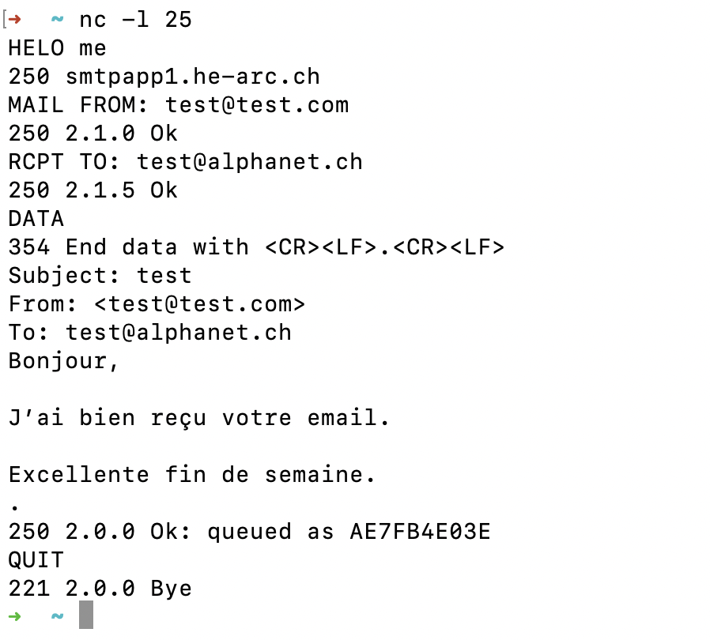
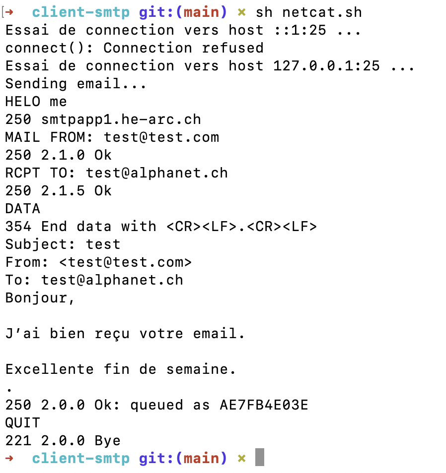
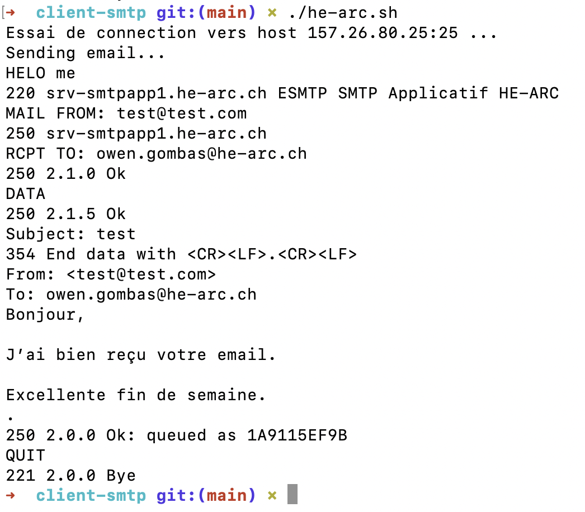
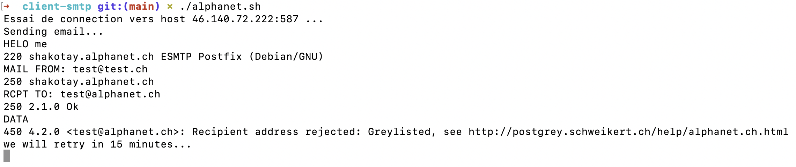
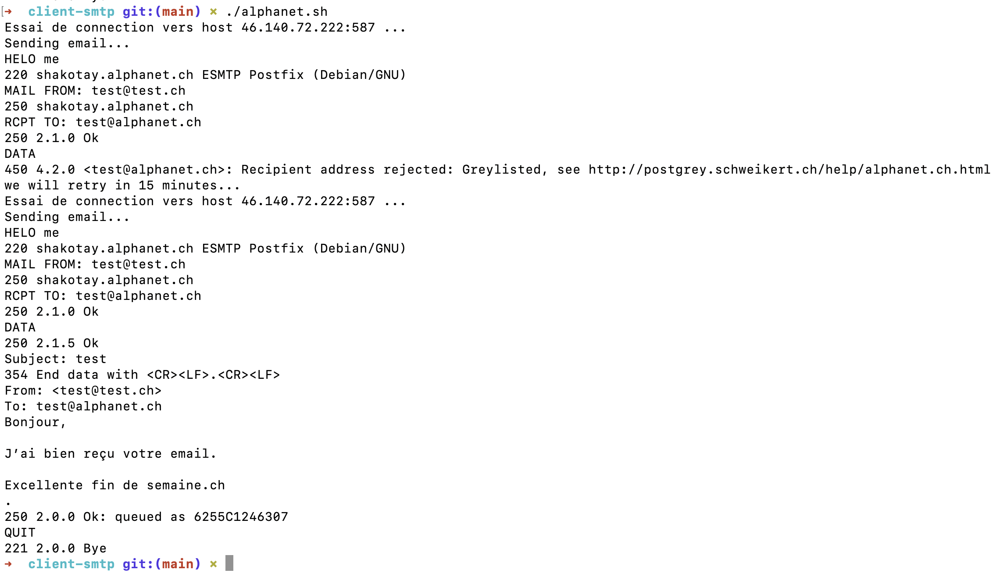
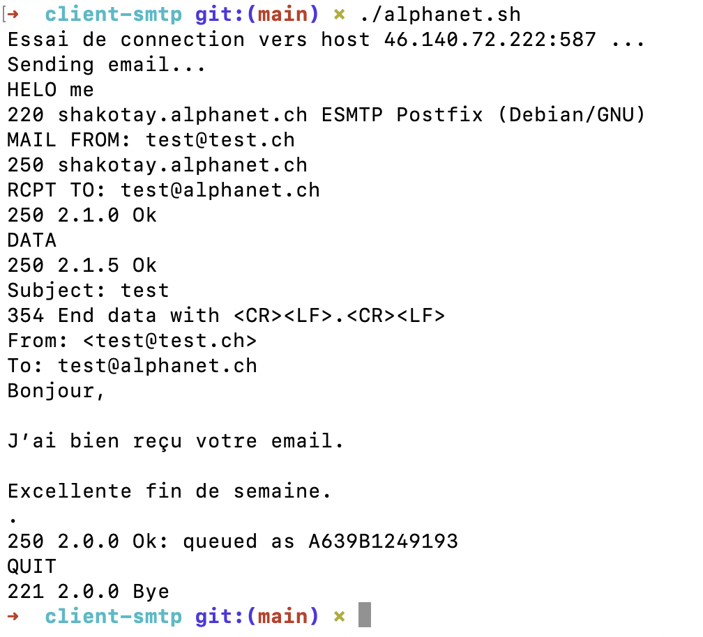
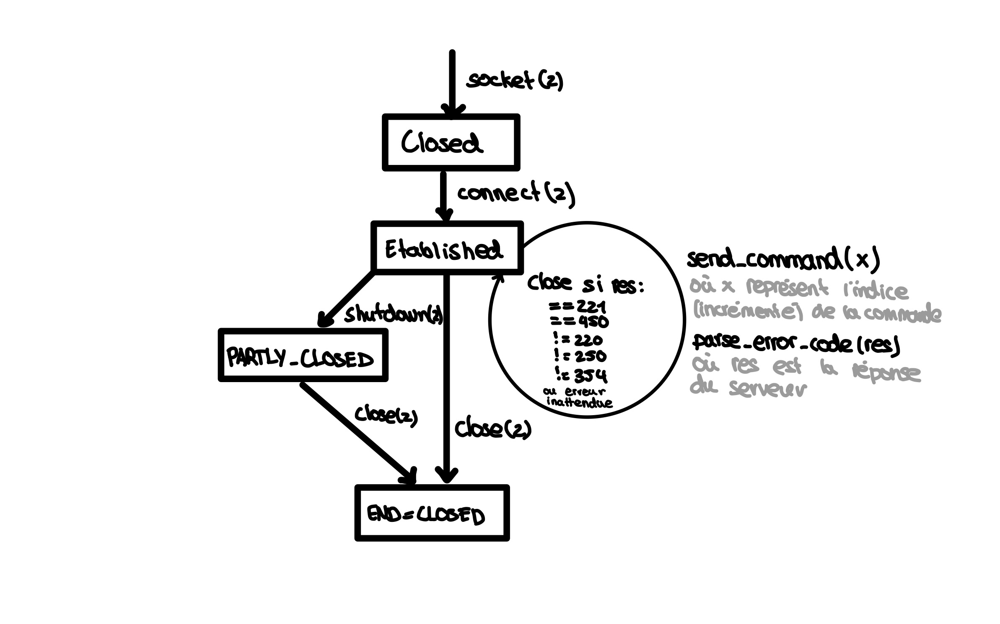

# Rapport du client SMTP en C
**20.06.2021**  
**ISC1c**
- [Owen Gombas](https://github.com/OwenCalvin)
- [David Darmanger](https://github.com/darmangerd)
- [Clément Brigliano](https://github.com/clms0u)

## Objectifs du rapport
- ✅ Tests documentés sur `netcat`, `smtprel.he-arc.ch` et `smtp.alphanet.ch` (minimum: copie d'écran)

- ✅ Une documentation utilisateur très simplifiée (comment utiliser votre programme)

- ✅ Le scan d'un dessin d'automate simplifié

- ✅ Une explication dans les grandes lignes de la structure du logiciel (fonctions, structures de données), y compris la notion d'automate

- ✅ Une documentation simple de génération du logiciel (comment vous compilez le logiciel, peut être une seule ligne!)

# Compiler le programme et comment l'utiliser
Un Makefile est fourni il vous suffit d'exéecuter la commande suivante:

```
make
```

Un binaire `client` est alors généré, vous pouvez l'exécuter avec les arguments suivant:
1. Adresse email de l'expéditeur
2. Le sujet du mail (entre guillemets s'il contient des espaces)
3. Le chemin du fichier contenant le texte de l'email
4. L'adresse du serveur de mail
5. L'adresse email de destination
6. OPTIONNEL: Le numéro de port (25 par défaut)

## Exemples

### Envoie sur localhost
1. **Adresse email de l'expéditeur**  
   test@test.com

2. **Sujet**  
   "test"

3. **Contenu (le contenu du fichier est traité)**  
   content.txt 
   
4. **Adresse du serveur de mail**  
   localhost
   
5. **Adresse email du destinataire**  
   test@alphanet.ch
   
6. **Numéro de port (optionnel, 25 par défaut)**  

```
$ ./client test@test.com "test" content.txt localhost test@alphanet.ch
```

### Envoie sur le serveur de l'HE-Arc (`smtprel.he-arc.ch`)
1. **Adresse email de l'expéditeur**  
   test@test.com

2. **Sujet**  
   "test"

3. **Contenu (le contenu du fichier est traité)**  
   content.txt 
   
4. **Adresse du serveur de mail**  
   smtprel.he-arc.ch
   
5. **Adresse email du destinataire**  
   VOTRE@ADRESSE.EMAIL
   
6. **Numéro de port (optionnel, 25 par défaut)**  

```
$ ./client test@test.com "test" content.txt smtprel.he-arc.ch VOTRE@ADRESSE.EMAIL
```

### Envoie sur (`smtp.alphanet.ch`)
1. **Adresse email de l'expéditeur**  
   test@test.com

2. **Sujet**  
   "test"

3. **Contenu (le contenu du fichier est traité)**  
   content.txt 
   
4. **Adresse du serveur de mail**  
   smtp.alphanet.ch
   
5. **Adresse email du destinataire**  
   test@alphanet.ch
   
6. **Numéro de port (optionnel, 25 par défaut)**   
   587 

```
$ ./client test@test.ch "test" content.txt smtp.alphanet.ch test@alphanet.ch 587
```


# Tests avec netcat (`nc`)
On va tester que le NVT fonctionne grâce à netcat
```
$ ./client test@test.com "test" content.txt localhost test@alphanet.ch
```

ou 

```sh
./netcat.sh
```

## 1. Initialisation
Ici l'on peut déjà deviner que le NVT fonctionne, car le client envoie uniquement la première ligne au serveur et attend qu'il réponde pour continuer




## 2. Envoie de la deuxième commande
On a la confirmation que le NVT fonctionne car après avoir répondu dans le terminal avec netcat le client envoie la prochaine ligne

> Nous avons écrit `250 smtpapp1.he-arc.ch` nous même dans la fenêtre netcat




## 3. Envoie de toutes le lignes jusqu'à la fin
On vous simplifie toutes les réponses qu'on a écrites à la main, mais voici à quoi ressemble le dialogue client serveur jusqu'à la fin de la connexion

> Le cas du DATA est bien pris en compte jusqu'au point




# Test avec le serveur de l'HE-Arc (`smtprel.he-arc.ch`)

```
$ ./client test@test.com "test" content.txt smtprel.he-arc.ch VOTRE@ADRESSE.EMAIL
```

ou

*Remplacez l'adresse email par la vôtre dans le script*
```
./he-arc.ch
```




L'envoi de l'email se déroule comme prévu (avec le NVT), aucun problème.

# Test avec le serveur `smtp.alphanet.ch`
```
$ ./client test@test.ch "test" content.txt smtp.alphanet.ch test@alphanet.ch 587
```

ou

```
./alphanet.ch
```

> On remplace le port 25 par 587 ici

**Ici on prend en charge le cas d'une erreur 450 de grey-listing, le programme ferme la connexion et réessaie dans 15 minutes**


**Après 15 minutes d'attente le programme réessaie d'envoyer le mail et ça fonctionne**


**Désormais, si l'on réessaie directement, l'adresse test@test.ch ne devrait plus être greylistée et on ne devrait pas devoir attendre. C'est bien le cas**


# Documentation du code
Le code est commenté et documenté avec des docstring.

## includes
Le programme utilise toutes les dépendances suivantes
```c
#include <arpa/inet.h>
#include <netdb.h>
#include <stdio.h>
#include <stdlib.h>
#include <string.h>
#include <sys/socket.h>
#include <sys/types.h>
#include <unistd.h>
```

## Fonctions
```c
/**
 * Read the content of a file
 * @param path The file path
 * @return The content of the file as a string
 */
char *read_file(char *path);

/**
 * Parse the error code to get something that is easiest to treat in the main
 * program
 * @return An int that represent the error code (2xx 3xx 4xx 5xx 221 354 or 450)
 * @param buffer The response from the server
 */
int parse_error_code(char *buffer);

/**
 * Get the command pair, with the format and the variable in the correct order
 * for the SMTP
 * @param dest The destination variable
 * @param index The index of the command
 * @param argv The argv of the program
 */
void get_command(char *dest[2], int index, char **argv);

/**
 * Send a SMTP command to the server and print it in the terminal
 * @param f The file that represent the connection to the server
 * @param index The SMTP command index
 * @param argv The argv of the program
 */
void send_command(FILE *f, int index, char **argv);

/**
 * Connect to a server using TCP
 * @param hostname The hostname of the server (localhost, smtp.alphanet.ch, ...)
 * @param port The port number to connect (as a string)
 * @return It returns a FILE *, you can send datas to the server by using
 * functions that are made for files
 */
static FILE *tcp_connect(const char *hostname, const char *port);

int main(int argc, char **argv);
```

### `char *read_file(char *path);`
Lis le contenu d'un fichier

#### Paramètres
- **path**   
  Le chemin du fichier


#### Retourne
Le contenu du fichier comme chaîne de caractère


### `int parse_error_code(char *buffer)`
Interprète le code d'erreur sous forme de string (char *) pour retourner un entier qui est plus facile à traiter

#### Paramètres
- **buffer**  
  La réponse du serveur (sous forme de string)


#### Retourne
Un entier qui représente le code d'erreur (2xx 3xx 4xx 5xx 221 354 ou 450)


### `void get_command(char *dest[2], int index, char **argv)`

Retourne via le premier paramètre (pointeur) une paire (sous forme d'un tableau de deux valeurs) de chaîne de caractères, la première valeur représente le format de la commande et la deuxième représente la variable à injecter dans la chaîne de caractères

#### Paramètres
- **dest**  
  La valeur "retournée" est mise dans ce paramètre

- **index**  
  L'indice de la commande, dans l'ordre des commandes à envoyer au serveur SMTP

- **argv**  
  La variable `argv` du programme

#### Retourne
La fonctionne retourne via `dest`, la paire format-variable à envoyer pour un certain indice


### `void send_command(FILE *f, int index, char **argv)`
Envoie la commande situés à l'indice *n* (index) au serveur SMTP et l'affiche dans la console

#### Paramètres
- **f**  
  Le fichier représentant la connexion au serveur SMTP

- **index**  
  L'indice de la commande, dans l'ordre des commandes à envoyer au serveur SMTP

- **argv**  
  La variable `argv` du programme

#### Retourne
Ne retourne rien: `void`


### `static FILE *tcp_connect(const char *hostname, const char *port)`
Se connecte à un serveur en TCP

#### Paramètres
- **hostname**  
  Le nom de domaine ou IP du serveur auquel on veut se connecter (localhost, smtp.alphanet.ch, ...)

- **port**  
  Le numéro de port auquel on ve se connecter (char *)

#### Retourne
Il retourne un `FILE *` qui représente la connexion au serveur, on peut alors utiliser toutes les fonctions destinées aux fichiers afin d'envoyer et recevoir des informations avec le serveur

## Fonctionnement du programme
1. On se connecte au serveur indiqué dans les arguments du programme
2. On envoie ligne par ligne (NVT, en attendant la réponse du serveur avant) notre "requête" SMTP
   1. On traite la réponse pour obtenir un code d'erreur
   2. On effectue les bonnes actions en fonction de ce code d'erreur (220, 250, 354, 221, 450).
      1. **Si** on a un code **450** on réémet après 15 minutes pour le grey-listing
      2. **Si** on a un code **221** on "close" la connexion
      3. etc... (A voir dans le switch du code)
3. On a la confirmation du serveur que l'email est bien envoyé on peut alors fermer proprement la connexion

# Schéma de l'automate

